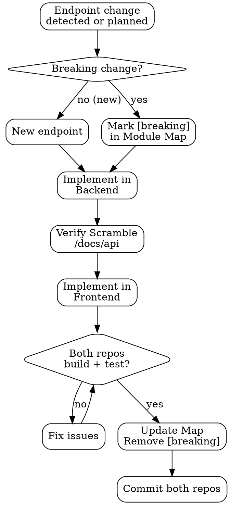

# API Contract Sync

## Overview

The root `CLAUDE.md` Module/Feature Map is the single source of truth for the backend↔frontend contract. This skill enforces that the map, the Scramble output (`/docs/api`), and the frontend consumption code stay in sync at all times. It handles both routine endpoint changes and breaking changes.

<HARD-GATE>
**Never leave a `[breaking]` entry in the Module/Feature Map at the end of a task.** A breaking change is open technical debt that blocks both repos. If you cannot complete both sides of a breaking change in a single session, document explicitly in the Estado column what remains, assign it as the next task, and ensure both repos still compile independently (use feature flags or versioned endpoints if necessary).
</HARD-GATE>

## Anti-Pattern: "Silent Breaking Change"

Modifying a controller, renaming a field in an API Resource, or changing HTTP method/path without: (1) marking the map as `[breaking]`, (2) updating the frontend consumer, and (3) verifying both repos build. This leaves the system in an inconsistent state that only surfaces at runtime.

## Checklist

**For any endpoint addition:**
1. Implement in backend, verify Scramble shows it correctly
2. Add row to Module/Feature Map with status `Pendiente`
3. Implement consumption in frontend
4. Update status to `Completado`

**For a breaking change (endpoint modified, renamed, removed):**
1. Mark affected entry as `[breaking]` in Module/Feature Map
2. Implement change in backend (source repo)
3. Verify Scramble reflects the change at `/docs/api`
4. Update frontend consumption code
5. Run `npm run build` in frontend — must pass
6. Run `sail test` in backend — must pass
7. Remove `[breaking]` status — set to `Completado` or `En progreso`
8. Commit both repos (or single commit if monorepo)

## Process Flow



## The Process

### Step 1 — Identify the Change Type

| Change | Breaking? | Action |
|--------|-----------|--------|
| New endpoint | No | Add to map, implement both sides |
| New optional field in response | No | Frontend ignores unknown fields safely |
| New required field in request | **Yes** | Frontend must send it |
| Field renamed in request or response | **Yes** | Frontend references break |
| Endpoint path changed | **Yes** | Frontend fetch URLs break |
| HTTP method changed | **Yes** | Frontend fetch method breaks |
| Endpoint removed | **Yes** | Frontend references break |
| Response structure reorganized | **Yes** | Frontend Zod schemas break |

### Step 2 — Scramble as Ground Truth (Backend)
After every backend change:
1. Run `sail up -d`
2. Open `http://localhost/docs/api` (or fetch `/docs/api.json`)
3. Verify the endpoint appears with the correct:
   - HTTP method and path
   - Request body parameters (from Form Request)
   - Response schema (from API Resource)
4. If Scramble doesn't reflect the change, the Form Request or API Resource is missing type information — fix it before proceeding

### Step 3 — Module/Feature Map Update
The map in root `CLAUDE.md` must be updated:

```markdown
| Module Backend | Level | Feature(s) Frontend | Level | Main Endpoints | Status |
|----------------|-------|---------------------|-------|----------------|--------|
| Orders         | 2     | orders              | 2     | GET /api/orders, POST /api/orders | [breaking] |
```

**Status values:**
- `Pendiente` — planned, not implemented
- `En progreso` — partially implemented
- `[breaking]` — change made on one side, other side not yet updated
- `Completado` — both sides implemented, tested, and documented

### Step 4 — Frontend Zod Schema Update
When a response shape changes, update the Zod schema in the affected feature's `schemas/` directory. The TypeScript compiler will then surface every usage that needs updating:

```typescript
// features/orders/schemas/order.schema.ts
export const OrderSchema = z.object({
  id: z.number(),
  // Add/rename/remove fields here — TypeScript errors guide the rest
  status: z.enum(['pending', 'confirmed', 'shipped', 'cancelled']),
  total: z.number().positive(),
});
```

### Step 5 — Verification Gates
Both repos must pass independently before marking a breaking change resolved:

**Backend:**
```bash
sail test          # all Pest tests green
sail pint --test   # zero style violations
```

**Frontend:**
```bash
npm run build      # TypeScript + lint clean
npm run test       # all Vitest tests green
docker compose build  # Docker image compiles
```

### Step 6 — ADR for Structural Changes
If a breaking change reflects a significant architectural decision (API versioning, resource restructuring, new authentication scheme), document it:
- `docs/ADR/NNN-title.md` in the affected repo(s)
- Reference the ADR in the Module/Feature Map comment

## After Completion

**Documentation (ALWAYS update before closing the task):**
- Root `CLAUDE.md` Module/Feature Map — Status column, Endpoints column
- Backend module `CLAUDE.md` — API Pública section
- Frontend feature `CLAUDE.md` — API Consumption section
- ADR if the change represents a significant decision
- All documentation in the **same commit** as the code in each repo

## Key Principles

- **Map = contract** — if it's not in the Module/Feature Map, it's not part of the contract
- **Scramble is the backend's single source of API truth** — not comments, not Postman collections
- **Zod is the frontend's guard** — schema changes propagate TypeScript errors automatically
- **`[breaking]` is a temporary state, never a resting state** — resolve it before ending the session
- **Both repos must compile independently** — never leave one repo broken waiting for the other
- **Documentation syncs with code** — map update goes in the same commit as the implementation
