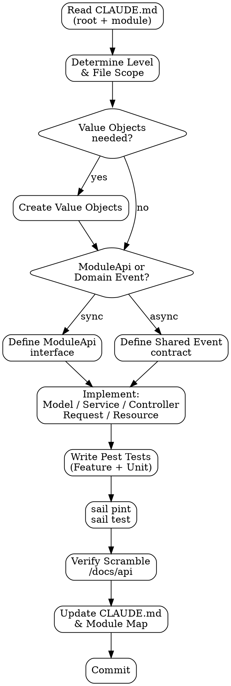

# Backend Module Development

## Overview

Implements a single task (new module, new endpoint, new service, bug fix) within the Laravel Modular Monolith architecture. Every task ends with updated documentation and passing tests.

<HARD-GATE>
**ALL commands run inside Sail.** Never run `php`, `composer`, `artisan`, or `./vendor/bin/pest` directly on the host. Use `sail artisan`, `sail composer`, `sail test`, `sail pint`. A command run outside Sail produces a different PHP version, different env vars, and silently wrong results.
</HARD-GATE>

## Anti-Pattern: "Fat Controller"

Putting business logic, Eloquent queries, or conditional branching inside controllers or Form Requests. Controllers have one job: receive a validated request, call a service, return a resource. Business rules live in services and models.

## Checklist

1. **Read root `CLAUDE.md`** — confirm module exists in the Module/Feature Map
2. **Read the module's `CLAUDE.md`** — understand its current state, rules, events
3. **Confirm complexity level** — Nivel 1 / 2 / 3 determines what files to create
4. **Check Value Object needs** — any typed domain concept needs a Value Object
5. **Check inter-module communication** — ModuleApi (sync) or Domain Event (async)?
6. **Check WebSocket needs** — does any result need to be broadcast via Reverb?
7. **Implement** following file roles in section 6 of `ARCHITECTURE.md`
8. **Write Pest tests** — feature tests for every new use case, unit tests for models with rules
9. **Run `sail pint`** — zero style violations before commit
10. **Run `sail test`** — all tests green
11. **Verify Scramble** — open `/docs/api` and confirm new/changed endpoints appear correctly
12. **Update module `CLAUDE.md`**
13. **Update root `CLAUDE.md` Module/Feature Map**
14. **Commit** — Conventional Commits, documentation in same commit as code

## Process Flow



## The Process

### Step 1 — Context
Before any code: read root `CLAUDE.md` and the target module's `CLAUDE.md`. If the module doesn't exist, create it with its `CLAUDE.md` and `ServiceProvider` first.

### Step 2 — Complexity Level
Determine what files to create:

| Level | Creates | Skips |
|-------|---------|-------|
| 1 | Model, Controller, Request, Resource, Migration, Tests | Service (optional), Repository, Events |
| 2 | Full structure — Model, Service, Controller, Request, Resource, Events, Listeners, Migrations, Seeder, Tests | Repository (unless complex queries) |
| 3 | Level 2 + multiple Services, Repository, external adapters | — |

### Step 3 — Value Objects
Any domain concept with a validation rule or business meaning needs a Value Object. Examples: `Email`, `Money`, `OrderStatus`, `DateRange`. Implement as Laravel Casts where appropriate. Never pass raw primitives across module boundaries.

### Step 4 — Inter-Module Communication
- **ModuleApi** — when module A needs data from module B synchronously. Define the interface in module B, bind it in `BModuleServiceProvider`, inject the interface (never the implementation) in module A's service.
- **Domain Event** — when module A needs to notify that something happened, without caring who listens. Event contract lives in `app/Shared/Events/`. Listeners register in their own ServiceProvider.
- **Never** — cross-module Eloquent relationships, direct table queries, or importing internal classes from another module.

### Step 5 — File Roles (summary)
- `Models/` — Eloquent + business invariants + Value Objects. Not anemic.
- `Services/` — One public method = one use case. Returns `Result` for business errors.
- `Http/Controllers/` — Zero logic: validate → call service → return resource.
- `Http/Requests/` — Input validation only (format rules, required fields). Business rules go in service.
- `Http/Resources/` — Output transformation. Keeps internal representation decoupled from API contract.
- `Events/` — Events this module emits.
- `Listeners/` — Handlers for events from other modules.
- `[Module]ModuleApi.php` — Interface defining everything other modules can consume.

### Step 6 — Pest Tests

**Feature tests** are the primary test type. They test the full flow: HTTP → controller → service → DB → response.

```php
uses(RefreshDatabase::class);

it('rejects duplicate email on registration', function () {
    User::factory()->create(['email' => 'test@example.com']);

    postJson('/api/auth/register', ['email' => 'test@example.com', ...])
        ->assertStatus(422)
        ->assertJsonValidationErrors(['email']);
});
```

Rules:
- AAA pattern: Arrange → Act → Assert
- One test = one behavior
- Use Factories, not hardcoded data
- Use `expect()` Pest API, not `$this->assert*()`
- Mock only external APIs and other module's ModuleApi — never mock the database
- Tests for WebSocket: verify the event is dispatched on the correct channel

### Step 7 — Style + Quality Gates
```bash
sail pint              # auto-fix style issues
sail pint --test       # verify (for CI — zero violations required)
sail test              # all tests must be green
```

### Step 8 — Scramble Verification
With `sail up -d` running, open `http://localhost/docs/api`. Verify:
- New endpoints appear with correct HTTP method, path, parameters, and response schema
- Modified endpoints reflect the change
- No endpoints accidentally removed

Scramble reads Form Requests (parameters) and API Resources (response shape) automatically. Keep them well-typed.

## After Completion

**Documentation (ALWAYS update before closing the task):**
- `app/Modules/[Module]/CLAUDE.md` — update Purpose, Models, Business Rules, Events, API Public sections
- Root `CLAUDE.md` Module/Feature Map — update Estado and Endpoints columns
- `docs/ADR/NNN-title.md` — if a significant technical decision was made
- All documentation changes go in the **same commit** as the code

## Key Principles

- **Sail is the boundary** — everything runs in containers, always
- **Modules don't know each other internally** — only interfaces and contracts
- **Result for business errors, exceptions for infrastructure** — never 500 on a validation rule
- **Tests are not optional** — every new use case needs at least one feature test
- **Scramble is the API contract** — if it's not in `/docs/api`, it doesn't exist for the frontend
- **Documentation in the same commit** — a code change without docs is an incomplete change
