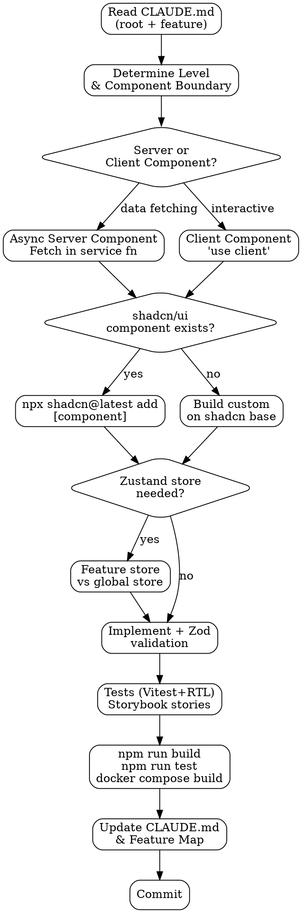

# Frontend Feature Development

## Overview

Implements a single task (new feature, new component, new page, bug fix) within the Next.js Feature-Based architecture. Every task ends with updated documentation, passing tests, and updated Storybook stories.

<HARD-GATE>
**`app/` is orchestration only — no business logic lives there.** Pages (`page.tsx`) and layouts (`layout.tsx`) may only: fetch data (Server Components), compose feature components, and pass data as props. Business logic, state, and UI implementation belong exclusively in `src/features/[feature]/`. Never add `'use client'` to `app/` files without an ADR.
</HARD-GATE>

## Anti-Pattern: "useEffect Data Fetching"

Using `useEffect` + `fetch` as the primary data fetching pattern when a Server Component can fetch the data at render time. Server Components are the default — use them. Client Components (`'use client'`) are for interactivity, subscriptions, and browser APIs only.

## Checklist

1. **Read root `CLAUDE.md`** — confirm feature exists in the Module/Feature Map
2. **Read the feature's `CLAUDE.md`** — understand its current state, exports, dependencies
3. **Confirm complexity level** — Nivel 1 / 2 / 3 determines structure
4. **Determine Server / Client boundary** — where does data fetching happen vs. interactivity?
5. **Check shadcn/ui** — does a needed component already exist? Use it, don't rebuild
6. **Check Zustand scope** — is state local to the feature or truly global?
7. **Validate external data with Zod** — never trust raw API responses
8. **Implement** following the feature structure for the assigned level
9. **Write Vitest + RTL tests** — Client Components, hooks, stores, Zod schemas
10. **Create Storybook stories** — for every new/modified UI component
11. **Run `npm run build`** — no TypeScript errors, no lint errors
12. **Run `npm run test`** — all tests green
13. **Run `docker compose build`** — Docker image still builds
14. **Update feature `CLAUDE.md`**
15. **Update root `CLAUDE.md` Module/Feature Map**
16. **Commit** — Conventional Commits, documentation in same commit as code

## Process Flow



## The Process

### Step 1 — Context
Read root `CLAUDE.md` and the target feature's `CLAUDE.md`. If the feature doesn't exist, create its directory with its `CLAUDE.md` first.

### Step 2 — Complexity Level & Structure

| Level | Structure |
|-------|-----------|
| 1 | `components/`, `exports/` (if consumed by others). No `services/`, no state. |
| 2 | `components/`, `services/`, `hooks/`, `stores/` (if needed), `schemas/`, `__tests__/`, `stories/`, `exports/` |
| 3 | Level 2 + multiple services, complex stores, third-party adapters |

### Step 3 — Server / Client Boundary

**Default: Server Component.** Use async/await, fetch data in `services/` functions, pass results as props.

```typescript
// features/products/services/get-products.ts
export async function getProducts(): Promise<Product[]> {
  const res = await fetch('/api/products', { cache: 'no-store' });
  const data: unknown = await res.json();
  return ProductListSchema.parse(data); // Always validate with Zod
}
```

**Switch to Client Component ONLY when you need:**
- Browser APIs (`window`, `localStorage`)
- Event listeners, subscriptions
- React hooks (`useState`, `useEffect`, custom hooks)
- Real-time WebSocket updates (Laravel Echo / Reverb)

Never put `'use client'` at the feature root — push it down to the leaf component that actually needs it.

### Step 4 — Zod Validation
Every response from an external API (backend or third-party) must be validated with a Zod schema. No raw `response.json()` cast to a TypeScript type.

```typescript
// features/products/schemas/product.schema.ts
import { z } from 'zod';

export const ProductSchema = z.object({
  id: z.number(),
  name: z.string().min(1),
  price: z.number().positive(),
});
export type Product = z.infer<typeof ProductSchema>;
```

### Step 5 — shadcn/ui First
Before building a custom component, check if shadcn/ui has one: Button, Input, Card, Dialog, Form, Select, Table, Tabs, Sheet, etc. Install with:
```bash
npx shadcn@latest add [component-name]
```
Components install to `src/shared/ui/` (configured in `components.json`). Customize via Tailwind utility classes and CSS variables from `shared/styles/globals.css` — never hardcode color or spacing values.

### Step 6 — Zustand State
- **Feature-local state**: Store lives in `features/[feature]/stores/`
- **Cross-feature / global state**: Store lives in `infrastructure/stores/`
- Always use selectors to subscribe: `useStore((s) => s.field)` — never subscribe to the whole store
- Never use React Context for state that Zustand can handle

### Step 7 — Feature Inter-Communication
- Import only from another feature's `exports/server.ts` or `exports/client.ts` — never from internal paths
- Never create barrel `index.ts` files that mix Server and Client components

### Step 8 — Testing (Vitest + RTL)

```typescript
// features/auth/components/__tests__/LoginForm.test.tsx
import { render, screen } from '@testing-library/react';
import userEvent from '@testing-library/user-event';
import { LoginForm } from '../LoginForm';

it('shows error when email is invalid', async () => {
  render(<LoginForm />);
  await userEvent.type(screen.getByLabelText('Email'), 'not-an-email');
  await userEvent.click(screen.getByRole('button', { name: /sign in/i }));
  expect(screen.getByText(/invalid email/i)).toBeInTheDocument();
});
```

Test: Client Components, custom hooks, Zustand stores, Zod schemas.
Do NOT test: Server Components directly (test their `services/` functions instead), real API calls.

### Step 9 — Storybook Stories
Every new or modified UI component needs a story. Storybook is configured with `experimentalRSC: true` so Next.js-specific hooks work without extra mocking.

```typescript
// features/products/components/stories/ProductCard.stories.tsx
import type { Meta, StoryObj } from '@storybook/nextjs';
import { ProductCard } from '../ProductCard';

const meta: Meta<typeof ProductCard> = { component: ProductCard };
export default meta;

export const Default: StoryObj<typeof ProductCard> = {
  args: { name: 'Widget', price: 29.99 },
};
```

### Step 10 — Quality Gates

```bash
npm run build          # TypeScript errors + lint violations fail the build
npm run test           # All Vitest tests green
docker compose build   # Docker image must still compile
npm run storybook      # Storybook starts without errors (manual check)
```

## After Completion

**Documentation (ALWAYS update before closing the task):**
- `src/features/[feature]/CLAUDE.md` — update Purpose, Components, State, API Consumption, Exports sections
- Root `CLAUDE.md` Module/Feature Map — update Estado and any endpoint changes
- `docs/ADR/NNN-title.md` — if a significant technical decision was made (e.g., added a third-party library, changed state strategy)
- All documentation in the **same commit** as the code

## Key Principles

- **Server Components by default** — `'use client'` only when unavoidable
- **`app/` orchestrates, features implement** — no business logic in pages or layouts
- **Zod is the contract enforcer** — never trust external data without validation
- **shadcn/ui is the design system** — build on it, don't replace it
- **Selectors prevent re-render cascades** — always subscribe to slices, not full stores
- **Docker must always build** — the image is the deployable artifact; a broken build = broken deployment
- **Documentation in the same commit** — a code change without docs is an incomplete change
