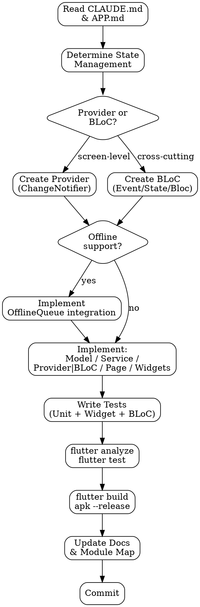

# Mobile Feature Development

## Overview

Implements a single task (new screen, new provider, new service, bug fix) within the Flutter layered architecture. Every task ends with updated documentation and passing tests.

<HARD-GATE>
**No business logic in pages.** Pages (`*_page.dart`) may only: compose widgets, consume state from providers/blocs, and trigger navigation. Business logic lives in providers/blocs. Data access lives in services. A page calling `http.get()` or containing conditional business rules is a violation.
</HARD-GATE>

## Anti-Pattern: "setState Everywhere"

Using `setState` for state that should live in a provider or BLoC. `setState` is for local widget state only (animations, toggles, form field visibility). Any state that persists across navigation, is shared between widgets, or involves async operations belongs in a provider or BLoC.

## Checklist

1. **Read root `CLAUDE.md`** — confirm feature exists in the Module/Feature Map
2. **Read APP.md** — understand architecture conventions and patterns
3. **Determine state management** — Provider (screen-level) or BLoC (cross-cutting)?
4. **Determine navigation** — Named routes or GoRouter? New routes needed?
5. **Check offline requirements** — does this feature need offline support (OfflineQueue)?
6. **Check model needs** — new models required? Manual or codegen serialization?
7. **Implement** following the layered architecture: models → services → providers/blocs → pages → widgets
8. **Write tests** — unit tests for models/services, widget tests for pages, BLoC tests if applicable
9. **Run `flutter analyze`** — zero warnings before commit
10. **Run `flutter test`** — all tests green
11. **Run `flutter build apk --release`** — release build must succeed
12. **Update documentation**
13. **Commit** — Conventional Commits, documentation in same commit as code

## Process Flow



## The Process

### Step 1 — Context

Before any code: read root `CLAUDE.md` and `APP.md`. Understand current project structure, existing services, and providers/blocs already in place.

### Step 2 — State Management Decision

| Scenario | Use |
|----------|-----|
| Screen-level state (form, list, toggles) | Provider (ChangeNotifier) |
| Cross-cutting concern (auth, connectivity, permissions) | BLoC |
| Local widget state (animation, toggle) | setState |
| Type-safe DI needed | Riverpod |

### Step 3 — Implementation Order

Always implement bottom-up following the dependency flow:

1. **Models** — data classes with `fromJson`/`toJson`
2. **Services** — ApiService calls, StorageService operations, business logic
3. **Providers/BLoCs** — state management orchestrating services
4. **Pages** — full-screen widgets composing UI and consuming state
5. **Widgets** — reusable UI components

### Step 4 — Provider Implementation

Use `ProviderErrorMixin` for consistent error/loading handling:

```dart
class OrderProvider extends ChangeNotifier with ProviderErrorMixin {
  List<Order> orders = [];

  Future<void> loadOrders() async {
    await runSafe(() async {
      final response = await ApiService.get('/orders');
      orders = (response['data'] as List).map((e) => Order.fromJson(e)).toList();
    });
  }

  Future<void> createOrder(Map<String, dynamic> data) async {
    await runSafe(() async {
      await ApiService.post('/orders', body: data);
      await loadOrders(); // Refresh list
    });
  }
}
```

### Step 5 — Page Implementation

Pages compose widgets and consume state. Zero business logic:

```dart
class OrdersPage extends StatefulWidget {
  const OrdersPage({super.key});
  @override
  State<OrdersPage> createState() => _OrdersPageState();
}

class _OrdersPageState extends State<OrdersPage> {
  @override
  void initState() {
    super.initState();
    context.read<OrderProvider>().loadOrders();
  }

  @override
  Widget build(BuildContext context) {
    final provider = context.watch<OrderProvider>();

    if (provider.loading) return const Center(child: CircularProgressIndicator());
    if (provider.error != null) return Center(child: Text(provider.error!));

    return ListView.builder(
      itemCount: provider.orders.length,
      itemBuilder: (_, i) => OrderCard(order: provider.orders[i]),
    );
  }
}
```

### Step 6 — Offline Support (if needed)

When the feature must work offline:

1. **Read**: Try cache first, fallback to API, cache the response
2. **Write**: If online, send to API; if offline, enqueue in OfflineQueue
3. **Sync**: OfflineQueue.sync() runs automatically on reconnect via ConnectionBloc

```dart
Future<void> createOrder(Map<String, dynamic> data) async {
  try {
    await ApiService.post('/orders', body: data);
  } on SocketException {
    await OfflineQueue.enqueue({'endpoint': '/orders', 'data': data});
  }
}
```

### Step 7 — Testing

#### Unit Tests — Models

```dart
void main() {
  group('OrderModel', () {
    test('fromJson creates valid instance', () {
      final json = {'id': 1, 'status': 'pending', 'total': 99.99};
      final order = OrderModel.fromJson(json);
      expect(order.id, 1);
      expect(order.status, 'pending');
    });

    test('fromJson handles null optional fields', () {
      final json = {'id': 1, 'status': 'pending', 'total': 99.99, 'notes': null};
      final order = OrderModel.fromJson(json);
      expect(order.notes, isNull);
    });
  });
}
```

#### Unit Tests — Providers

```dart
void main() {
  group('OrderProvider', () {
    late OrderProvider provider;
    late MockApiService mockApi;

    setUp(() {
      mockApi = MockApiService();
      provider = OrderProvider(api: mockApi);
    });

    test('loadOrders populates list on success', () async {
      when(() => mockApi.get('/orders'))
          .thenAnswer((_) async => {'data': [{'id': 1, 'status': 'pending', 'total': 99.99}]});

      await provider.loadOrders();

      expect(provider.orders, hasLength(1));
      expect(provider.error, isNull);
    });

    test('loadOrders sets error on failure', () async {
      when(() => mockApi.get('/orders'))
          .thenThrow(ApiException(statusCode: 500, message: 'Server error'));

      await provider.loadOrders();

      expect(provider.orders, isEmpty);
      expect(provider.error, isNotNull);
    });
  });
}
```

#### Widget Tests — Pages

```dart
void main() {
  group('OrdersPage', () {
    late MockOrderProvider mockProvider;

    setUp(() {
      mockProvider = MockOrderProvider();
      when(() => mockProvider.loading).thenReturn(false);
      when(() => mockProvider.error).thenReturn(null);
      when(() => mockProvider.orders).thenReturn([]);
    });

    Widget buildPage() {
      return MaterialApp(
        home: ChangeNotifierProvider<OrderProvider>.value(
          value: mockProvider,
          child: const OrdersPage(),
        ),
      );
    }

    testWidgets('shows loading indicator', (tester) async {
      when(() => mockProvider.loading).thenReturn(true);
      await tester.pumpWidget(buildPage());
      expect(find.byType(CircularProgressIndicator), findsOneWidget);
    });

    testWidgets('shows error message', (tester) async {
      when(() => mockProvider.error).thenReturn('Connection failed');
      await tester.pumpWidget(buildPage());
      expect(find.text('Connection failed'), findsOneWidget);
    });
  });
}
```

#### BLoC Tests

```dart
blocTest<AuthBloc, AuthState>(
  'emits [AuthAuthenticated] when AuthLogin is added',
  build: () => AuthBloc(storage: mockStorage),
  act: (bloc) => bloc.add(AuthLogin('test_token')),
  expect: () => [isA<AuthAuthenticated>()],
);
```

### Step 8 — Quality Gates

```bash
flutter analyze        # Zero warnings
flutter test           # All tests green
flutter build apk --release  # Release build succeeds
```

### Testing Dependencies

```yaml
dev_dependencies:
  flutter_test:
    sdk: flutter
  mocktail: ^1.0.4          # Mocking (no codegen needed)
  bloc_test: ^9.1.0         # BLoC testing utilities (if using BLoC)
  flutter_lints: ^6.0.0     # Linting
```

### What to Test (Priority Order)

1. **Models** — `fromJson`/`toJson` correctness, null handling, edge cases
2. **Services** — API calls return expected results, error handling works
3. **Providers/BLoCs** — State transitions are correct, side effects happen
4. **Critical widgets** — Login, forms, and interactive pages render and behave correctly
5. **Integration** — Happy paths work end-to-end

### Mocking Best Practices

- Use `mocktail` over `mockito` (no codegen required)
- Create mocks in a shared `test/mocks/` folder
- Inject dependencies via constructors to make classes testable
- Never test implementation details, test behavior

## After Completion

**Documentation (ALWAYS update before closing the task):**
- Root `CLAUDE.md` Module/Feature Map — update Estado and any endpoint changes
- `docs/ADR/NNN-title.md` — if a significant technical decision was made (e.g., added a third-party library, changed state strategy)
- All documentation in the **same commit** as the code

## Key Principles

- **Pages orchestrate, services implement** — no business logic in pages
- **Provider for screens, BLoC for cross-cutting** — right tool for the right scope
- **Services are the boundary** — all external communication goes through services
- **Offline is a first-class concern** — design for offline from the start, not as an afterthought
- **Tests are not optional** — every new feature needs at least model and provider tests
- **Documentation in the same commit** — a code change without docs is an incomplete change

## Coexistence with Superpowers

This skill activates during the **mobile implementation** phase (within each plan task).
Superpowers handles the TDD methodology (test-driven-development) and the execution framework (executing-plans).
This skill handles the technical standards: Flutter layered architecture, Provider/BLoC conventions, testing patterns, and quality gates.

When both are active:
- Superpowers TDD dictates the **order**: write test → watch it fail → implement → watch it pass
- This skill dictates the **technical content**: mocktail for mocking, widget tests with pumpWidget, BLoC tests with blocTest, what to test

If Superpowers is not installed, this skill works independently
including its own testing instructions (without strict TDD enforcement).

## Coexistence with frontend-design

Both skills may activate when building UI screens or components.
The `frontend-design` skill handles **visual aesthetics**: typography, color, motion, and spatial composition.
This skill handles **architecture and technical standards**: layered structure, state management, testing, and build verification.

When both are active, they complement each other — frontend-design guides how things look,
this skill guides how things are structured and tested.
